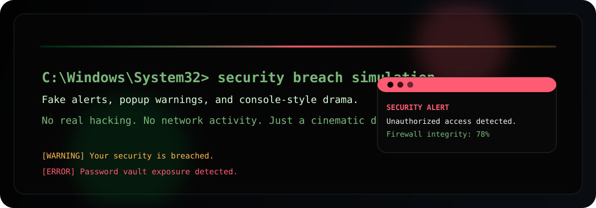

# Security Breach Simulation



A Windows-style Python desktop app that simulates a security breach in a fake `cmd`-like console.
It is intentionally cosmetic only. No real hacking, scanning, cracking, or network activity happens.

## What It Does

- Opens as a native Python desktop app on Windows
- Uses a dark command-prompt style UI
- Auto-runs a staged fake breach sequence
- Shows synthetic pop-up warnings and alerts
- Plays simple Windows sound cues with `winsound`
- Lets you stop the simulation with a panic button

## Highlights

- Black console-first design
- Resizable, responsive layout
- Typewriter-style command animation
- Fake firewall, credential, and leak meters
- Batch-file launcher for one-click startup

## Run

Double-click `run.bat` on Windows.

If you prefer launching from Python directly:

```bash
python app.py
```

## Project Files

- [`app.py`](app.py) - the desktop simulation
- [`run.bat`](run.bat) - one-click Windows launcher
- [`assets/hero.svg`](assets/hero.svg) - README banner

## Safety

This project is for visual simulation and UI practice only.
It does not perform real security work or touch any external system.

